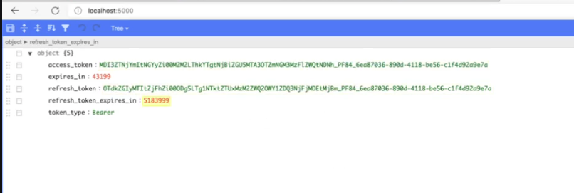

## Basic Authorization Sample

- This basic authorization app helps you visualize the Authentication & Authorization flow to obtain an Access Token to use the Webex Contact Center APIs.

- Webex Contact Center APIs use OAuth2. For more information, refer :

- The OAuth Flow can be visualized by going to the http://localhost of this app once the app dependencies are installed and the application is run.

## [Watch the Video: Understanding WebexCC OAuth2 - App Sample](https://app.vidcast.io/share/861a3320-669c-4edb-b284-3c1300130583)



#### Pre-Requisites:

- Node JS and NPM
- An IDE like VS Code or similar.

```
$ node -v
v14.16.1
$ npm -v
6.14.12
```

#### Steps:

- Ensure you have installed NodeJS and NPM
- Clone this Repository / Download it.
- Create a .env file in each of the folders with the settings of the environment variables required to initialize the environment variables. Your server.js will pick it up from the local .env file in the root folder.

`$ cat .env`

```
PORT=5000
CLIENT_ID=<your-client-id>
CLIENT_SECRET=<your-client-secret>
REDIRECT_URI=<your-redirect uri - ex: http://localhost:5000/auth/webex/callback>
ORG_ID=<your-org-id>
```

- Run `$ npm install`

- Run the App

`$ nodemon` OR `$ npm start`

- Go to http://localhost:5000 to fetch an access token
- Go to http://localhost:5000/tasks or http://localhost:5000/users to see the basic GET Tasks and GET Users examples.

Expand / extend the sample app(s) as required.

## Disclaimer

> These samples are meant to be used, as "samples", for demos, and to understand how to interact with the WebexCC APIs.
> When building a production grade solution, please consider the overall architecture and design with a security first approach.
> Also, please consider how you would extend this app for multiple orgs, manage tokens for those orgs, etc.
> These samples are only meant to provide working, starter code and many layers have been simplified and abstracted away to focus on the Webex Contact Center use cases.

## Support

For dedicated Developer Support on the APIs - Please open a ticket with the team using this link: **[Webex Contact Center Developer Support](https://developer.webex-cx.com/support)**

For discussions on the samples, feel free to participate in our Developer Community:

**[Webex Contact Center APIs Developer Community](https://community.cisco.com/t5/contact-center/bd-p/j-disc-dev-contact-center)**

Refer: **[How to Ask a Question or Initiate a Discussion](https://community.cisco.com/t5/contact-center/webex-contact-center-apis-developer-community-and-support/m-p/4558270)**
