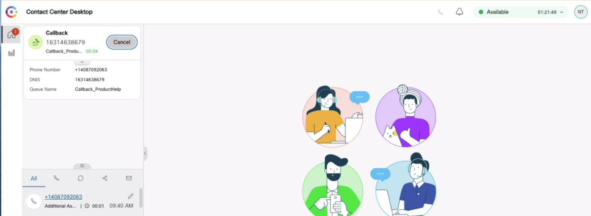

## Webcallback API - Configure Callbacks from your website using Webex Contact Center

Here is a sample of using the Web Callback Task API, the overview using Postman as well as a sample NodeJS backend for your webpage, using a simple HTML/CSS form that can be rendered on any webpage.
The example uses a Javascript injector called Scripty to inject the Callback form into any website of your choice.

## [Watch Now: Webcallback API Overview and Demo](https://app.vidcast.io/share/b26ca3a0-309a-4244-8455-56306b302573)

## Developer Documentation

**https://developer.webex-cx.com/documentation/tasks/v1/create-task**

## Getting Started

This app is assuming you already have done through the OAuth2 samples and have a Client ID and Client Secret to use the APIs. If you don't please go to [postman-sample](https://github.com/CiscoDevNet/webex-contact-center-api-samples/tree/main/postman-sample). For ease of use, this app only requires you to paste in your Bearer token.

In production, before actually deploying this you will still need to "maintain" API access via OAuth2 Access Tokens and Refresh Tokens. To understand how refresh tokens work, please refer the `token-app-sample`.

### Executing the Sample

How to run the app shown in the demo above:

- Step 1:

  - On the **server.js** file, line 89, please paste in your access token manually. You can do this by visiting the developer portal at developer.webex-cx.com and copying out your access token after Signing in.

- Step 2:

  - On the **server.js** file, line 12, add your own unique subdomain. ie: _myuniquecallback_

- Step 3:

  - Inside this project on your terminal type: `npm run local`
  - this should run the app on your localhost:5000 and well as give you a unique URL.

- Step 4:

  - Copy the unique URL to your clipboard.
  - On file **frontEndForm.js** paste in unique subdomain in line 9.

- Step 5:

  - Copy all the content of the file _**frontEndForm.js**_ into your Javascript Injector.

- _Informational:_
  - Purpose of the localtunnel library(_reverse proxy_) is to help with local Dev. Security on company laptops could make this feature inconsistent. You can decide to install Ngrok or other similar libraries. These samples are made to help/compliment the Cisco documentation. They are not intended to be production ready apps.

## Disclaimer

> These samples are meant to be used, as "samples", for demos, and to understand how to interact with the WebexCC APIs.
> When building a production grade solution, please consider the overall architecture and design with a security first approach.
> Also, please consider how you would extend this app for multiple orgs, manage tokens for the orgs, etc.
> These samples are only meant to provide working, starter code and many layers have been simplified and abstracted away to focus on the Webex Contact Center use cases.

## Support

For dedicated Developer Support on the APIs - Please open a ticket with the team using this link: **[Webex Contact Center Developer Support](https://developer.webex-cx.com/support)**

For discussions on the samples, feel free to participate in our Developer Community:

**[Webex Contact Center APIs Developer Community](https://community.cisco.com/t5/contact-center/bd-p/j-disc-dev-contact-center)**

Refer: **[How to Ask a Question or Initiate a Discussion](https://community.cisco.com/t5/contact-center/webex-contact-center-apis-developer-community-and-support/m-p/4558270)**

## Version History

- 1.0.0
  - Basic Webcallback API Sample
