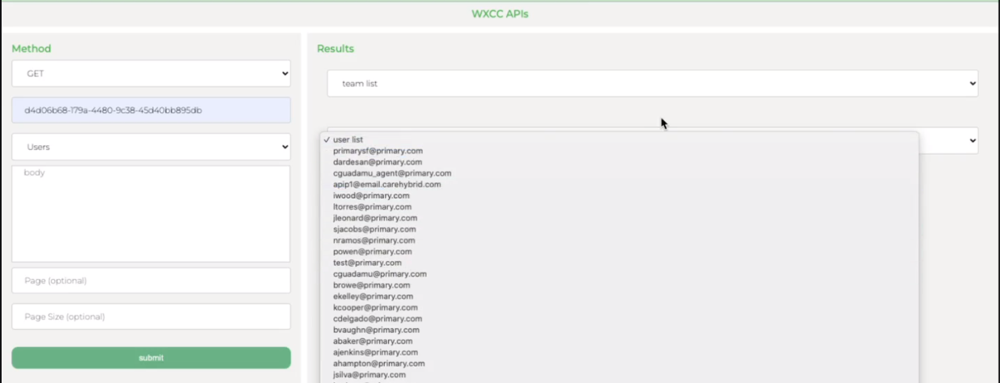

## Configuration API - Sample Frontend Application

Simple vanilla JS UI using some of the new Webex contact center APIs.
Watch the demo below to understand what this app does and how to set it up and extend on it.

## [Watch Now: Configuration App Sample Overview and Demo](https://app.vidcast.io/share/25878069-6460-4a18-aaef-8e639efc48d3)

## Getting Started

This app is assuming you already have a Client ID and Secret. If you don't please go to [postman-sample app](https://github.com/CiscoDevNet/webex-contact-center-api-samples/tree/main/postman-sample) and obtain your Client ID and Client Secret.

### Executing program

How to run the app:

- Step 1:

  - Rename the `copy.env` to `.env` and add your client Id, secret Id, redirect URI, etc...

- Step 2:
  - Inside this project on your terminal type: `npm run start`
  - this should run the app on your localhost:5000

## Disclaimer

> These samples are meant to be used, as "samples", for demos, and to understand how to interact with the WebexCC APIs.
> When building a production grade solution, please consider the overall architecture and design with a security first approach.
> Also, please consider how you would extend this app for multiple orgs, manage tokens for the orgs, etc.
> These samples are only meant to provide working, starter code and many layers have been simplified and abstracted away to focus on the Webex Contact Center use cases.

## Support

For dedicated Developer Support on the APIs - Please open a ticket with the team using this link: **[Webex Contact Center Developer Support](https://developer.webex-cx.com/support)**

For discussions on the samples, feel free to participate in our Developer Community:

**[Webex Contact Center APIs Developer Community](https://community.cisco.com/t5/contact-center/bd-p/j-disc-dev-contact-center)**

Refer: **[How to Ask a Question or Initiate a Discussion](https://community.cisco.com/t5/contact-center/webex-contact-center-apis-developer-community-and-support/m-p/4558270)**

## Version History

- 1.0.0
  - a few GET methods & updated readme
