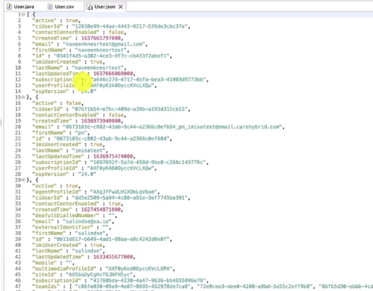

## Configuration Extraction Sample - Sample Java code that uses the new WebexCC APIs

This is a tutorial on how to use the new WebexCC APIs to extract configuration data and export to CSV or JSON.
In this tutorial we are using API described at [Getting Started](https://developer.webex-cx.com/documentation/getting-started).

Watch the demo below to understand what this project does, how to set it up and leverage it to build your own code.

## [Watch Now: Extract Configuration Data App Sample Overview and Demo](https://app.vidcast.io/share/33d1fee2-e721-41ae-848d-d02e700f9473)

## Getting Started

The code can be executed on localhost and is intended to bootstrap your knowledge of the WebexCC APIs.

To understand how to execute the code, please watch the video.

To understand additional features [Getting Started](https://developer.webex-cx.com/documentation/getting-started).

### Executing the sample

How to run the sample code:

**Step 1:**

- Download the Java code from github

**Step 2:**

- import the Java code into your favorite Java IDE.

**Step 3:**

- Edit the file src/main/resources/application.properties.
  -- access_token
  -- organizationId

**Step 4:**

- Right click on the Class and select run as application.

## Useful Links

**[WebexCC Developer Portal](https://developer.webex-cx.com/documentation/getting-started)**

## Disclaimer

> These samples are meant to be used, as "samples", for demos, and to understand how to interact with the WebexCC APIs.
> When building a production grade solution, please consider the overall architecture and design with a security first approach.
> Also, please consider how you would extend this app for multiple orgs, manage tokens for the orgs, etc.
> These samples are only meant to provide working, starter code and many layers have been simplified and abstracted away to focus on the Webex Contact Center use cases.

## Support

For dedicated Developer Support on the APIs - Please open a ticket with the team using this link: **[Webex Contact Center Developer Support](https://developer.webex-cx.com/support)**

For discussions on the samples, feel free to participate in our Developer Community:

**[Webex Contact Center APIs Developer Community](https://community.cisco.com/t5/contact-center/bd-p/j-disc-dev-contact-center)**

Refer: **[How to Ask a Question or Initiate a Discussion](https://community.cisco.com/t5/contact-center/webex-contact-center-apis-developer-community-and-support/m-p/4558270)**

## Version History

- 1.0.0
  - Initial example.
