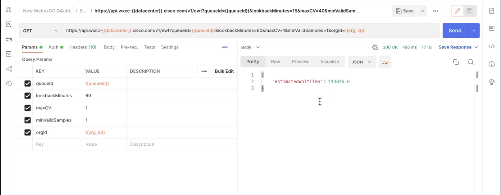

## Estimated Wait Time (EWT) - Using the EWT API to show the current wait time for the Contact Center

This video shows you how to generate some activity for the Estimated Wait Time (EWT) API in a demo, to help derive the wait time for customers and display it on your web site.

## [Watch: Estimated Wait Time(EWT) API - Showing customers their wait times on WebexCC](https://app.vidcast.io/share/85acd64a-b413-481c-9070-848d2fadb573)



## Developer Documentation

**https://developer.webex-cx.com/documentation/estimated-wait-time**

## Getting Started

This video doesn't necessarily need any additional setup as it is demonstrated using Postman and using the sample script in the video.

Import the following CURL command into Postman.

```bash
curl --location -g --request GET 'https://api.wxcc-{{datacenter}}.cisco.com/v1/ewt?queueId={{queueId}}&lookbackMinutes=5&maxCV=1&minValidSamples=1&orgId={{orgId}}' \
--header 'Authorization: Bearer {{token}}'
```

Remember to configure the following environment or local variables

- `datacenter` - Your Datacenter e.g us1
- `queueId` - Your Queue ID
- `orgId` - Your Org ID
- `token` - Your Token

Keep in mind that you still need to have your Postman setup with your authorization or at least using an unexpired Access Token to run this API.

### If you want to use the front-end JavaScript code:

**Step 1:**

- Copy all the content of the file _**ewt_frontend_form.js**_ into your Javascript Injector of choice.
- These injectors can be installed on your web browser for demos using the Extensions plugin marketplace on your browser.

## Disclaimer

> These samples are meant to be used, as "samples", for demos, and to understand how to interact w
> ith the WebexCC APIs.
> When building a production grade solution, please consider the overall architecture and design with a security first approach.
> Also, please consider how you would extend this app for multiple orgs, manage tokens for the orgs, etc.
> These samples are only meant to provide working, starter code and many layers have been simplified and abstracted away to focus on the Webex Contact Center use cases.

## Support

For dedicated Developer Support on the APIs - Please open a ticket with the team using this link: **[Webex Contact Center Developer Support](https://developer.webex-cx.com/support)**

For discussions on the samples, feel free to participate in our Developer Community:

**[Webex Contact Center APIs Developer Community](https://community.cisco.com/t5/contact-center/bd-p/j-disc-dev-contact-center)**

Refer: **[How to Ask a Question or Initiate a Discussion](https://community.cisco.com/t5/contact-center/webex-contact-center-apis-developer-community-and-support/m-p/4558270)**

## Version History

- 0.0.1

  - Beta version with basic free REST API Address book

    <!-- * See [commit change]() or See [release history]() -->
