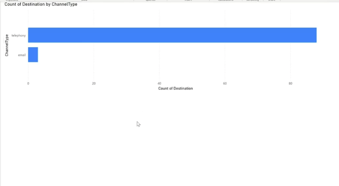

## Integrating Webex Contact Center with Microsoft Power BI

  

  

### Executing GraphQL Search API calls using Spring Boot

  

  

This is a sample web application to convert the WebexCC GraphQL search API string into web connector endpoint for external reporting sources such as Microsoft's Power BI. It uses a simple Spring Boot web application to expose a controller for the endpoint used by Power BI.

  

  

The application can be modified, enhanced or extended to fit the use cases required.

  

  

Watch the demo below to understand what this application does and how to set it up and extend on it.

  

  

## [Watch Now: Integrating Webex Contact Center with Power BI - Sample Spring Boot Application](https://app.vidcast.io/share/6fd7cd09-7930-488c-9f02-0baa13f1d0e3)

  

  

  

  

> **Note:** This is a sample that assumes you know the basics of GraphQL Search String API as well as Java/Spring Boot.
  
> This demo goes over the Java sample code that is used to connect Webex Contact Center with Microsoft Power BI. The code exports the Webex Contact Center reporting data available on the GraphQL "Search" API to a Web interface consumable by Microsoft Power BI. It leverages the power of Spring Boot to make this consumable by any external data lake.

*Search Queries*
located in the directory graphql-powerbi-sample/graphql/*
* task is supported
* taskDetails is supported
* agentSession is supported
* flowInteractions is NOT supported but can be upon request or code it yourself
* flowTraceEvents is NOT supported but can be upon request or code it yourself
* taskLegDetails is NOT supported but can be upon request or code it yourself

  

## Developer Documentation

  

  

**https://developer.webex-cx.com/documentation/search**

  

  

## Getting Started

  

The application is compatible with any Java Virtual Machine (JVM) environment. Detailed instructions for building and deploying the application on a local server are provided.

### Prerequisites

  

- JDK 11+ - To verify that JDK 11 is installed on your system, you can run the command java -version in the command line.

- Maven - To verify that maven is installed on your system, you can run the command mvn -v in the command line.

  

### Executing the sample

  

  

How to run the sample application:

  

  

**Step 1:**

  

  

- Download / Clone the repository and go to [graphql-powerbi-sample](https://github.com/CiscoDevNet/webex-contact-center-api-samples/graphql-powerbi-sample)

  

  

**Step 2:**

  

  

- Modify the property file under

  

`/src/main/resources/application.properties`

|NAME| VALUE |

|--|--|

| client_id | value from https://developer.webex-cx.com/my-apps |

| client_secret | value from https://developer.webex-cx.com/my-apps |

| redirect_uri | value from https://developer.webex-cx.com/my-apps |

| data_center_url | . . . . . . . . . . .**pick one** . . . . . . . . . . . . . . . . . . . . . . . . . . . . |

| |https://api.wxcc-us1.cisco.com |

| |https://api.wxcc-anz1.cisco.com |

| |https://api.wxcc-ca1.cisco.com |

| |https://api.wxcc-eu1.cisco.com |

| |https://api.wxcc-eu2.cisco.com |

| |https://api.wxcc-jp1.cisco.com|

  

  

**Step 3:**

  

- cd to webex-contact-center-api-samples\reporting-samples\graphql-powerbi-sample

- Install the dependencies using: `mvn clean install`

  

  

**Step 4:**

  

  

- Run the application locally using: `java -jar target\graphql-sample-java-0.0.1-SNAPSHOT.jar`

  

- This should run the app on `http://localhost:8080`

  

  

**Additional Improvements:**

  

  

- You can modify the application as required.

- Note: If jQuery returns a JSON with nested objects (objects within the main object), you'll need to customize your JSON to CSV conversion process. This requirement isn't due to a limitation of the software, but rather a consideration of how to effectively convert the structured response. You can opt to represent nested objects with multiple lines for each parent object, or alternatively, flatten the nested objects into a single row for a more streamlined CSV format.

  

  

## Useful Links - Supplemental Resources

  

  

- [Getting Started with GraphQL /search API](https://github.com/CiscoDevNet/webex-contact-center-api-samples/tree/main/graphql-sample)

  

  

- [GraphQL APIs Search Tasks](https://developer.webex-cx.com/documentation/search/v1/search-tasks)

  

  

- [My Apps](https://developer.webex-cx.com/my-apps)

  

  

## Disclaimer

  

  

> These samples are meant to be used, as "samples", for demos, and to understand how to interact with the WebexCC APIs.

  

> When building a production grade solution, please consider the overall architecture and design with a security first approach.

  

> Also, please consider how you would extend this app for multiple orgs, manage tokens for the orgs, etc.

  

> These samples are only meant to provide working, starter code and many layers have been simplified and abstracted away to focus on the Webex Contact Center use cases.

  

  

## Support

  

  

For dedicated Developer Support on the APIs - Please open a ticket with the team using this link: **[Webex Contact Center Developer Support](https://developer.webex-cx.com/support)**

  

  

For discussions on the samples, feel free to participate in our Developer Community:

  

  

**[Webex Contact Center APIs Developer Community](https://community.cisco.com/t5/contact-center/bd-p/j-disc-dev-contact-center)**

  

  

Refer: **[How to Ask a Question or Initiate a Discussion](https://community.cisco.com/t5/contact-center/webex-contact-center-apis-developer-community-and-support/m-p/4558270)**

  

  

## Version History

  

  

- 0.0.1

  

  

- Beta version with basic REST API GraphQL queries to Search Tasks