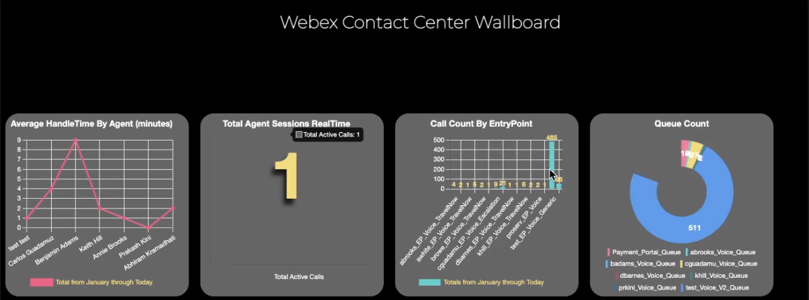

## Wallboard Sample using WebexCC Reporting APIs

Here is a sample of using the `Search` API (powered by GraphQL) to construct GraphQL queries that will fetch data from Webex Contact Center and display it as a simple visual charts on a Contact Center Wallboard. The application can be extended to add more queries and API calls.

## [Watch Now: GraphQL powered Wallboard Overview and Demo](https://app.vidcast.io/share/42059f9c-73b8-48eb-9099-0ea45308cd23)

## Developer Documentation

**https://developer.webex-cx.com/documentation/search**

## Getting Started

To understand how these backend API calls were built, refer the **[graphql-sample](https://github.com/CiscoDevNet/webex-contact-center-api-samples/tree/main/graphql-sample)** that contains a`wallboard-query-samples` folder with some sample queries. You can extend on those queries depending on what you want to retrieve from Webex Contact Center.

Follow the video embedded in the ReadMe for more information on the sample.

### Executing the Sample Application

Follow the steps to run the application as shown in the demo above:

- Step 1:

  - Rename the `copy.env` to `.env`.

- Step 2:

  - Open the `.env` file and add your tenant's `org_id` in the **ORG_ID** field.

- Step 3:

  - Still in the `.env` file, add your `access_token` in the **DEV_TOKEN** field. To get an access token, login to [developer.webex-cx.com](https://developer.webex-cx.com) and Sign in with a WebexCC Admin user.

- Step 3:

  - Inside this project on your terminal type: `npm install`

- Step 4:

  - Inside this project on your terminal type: `npm run dev`
  - This should run the app on your [http://localhost:3000](http://localhost:3000) as well as your own public URL.

- Step 5:

  - From here on please follow the video that will help guide you along.

- **Important Note**:
  - The `From` dates on the queries, will eventually become invalid. Depending on when you pull this sample down, pay attention to the epoch dates that are configured on the 4 graphQL queries.. JS files that are located in the controller/wallboard folders... ie `callCountByEntryPoint.js`

## Live Demo Link

- This sample is hosted if you would like to take a quick look. The hosting service is free so it might take about 30 seconds or so before it renders.
  URL: [https://graphql-y435.onrender.com/](https://graphql-y435.onrender.com/)

## Disclaimer

> These samples are meant to be used, as "samples", for demos, and to understand how to interact with the WebexCC APIs.
> When building a production grade solution, please consider the overall architecture and design with a security first approach.
> Also, please consider how you would extend this app for multiple orgs, manage tokens for the orgs, etc.
> These samples are only meant to provide working, starter code and many layers have been simplified and abstracted away to focus on the Webex Contact Center use cases.

## Support

For dedicated Developer Support on the APIs - Please open a ticket with the team using this link: **[Webex Contact Center Developer Support](https://developer.webex-cx.com/support)**

For discussions on the samples, feel free to participate in our Developer Community:

**[Webex Contact Center APIs Developer Community](https://community.cisco.com/t5/contact-center/bd-p/j-disc-dev-contact-center)**

Refer: **[How to Ask a Question or Initiate a Discussion](https://community.cisco.com/t5/contact-center/webex-contact-center-apis-developer-community-and-support/m-p/4558270)**

## Version History

- 1.0.0
  - Basic graphQL Wallboard Sample
