# Webex Instant Connect with Webex Contact Center

> **Digital \(Web Chat OR SMS OR WhatsApp OR Social\) to Video Escalation to enable Video in Contact Centers**

# Overview

Customers reach businesses via Webex Contact Center to be connected to Agents\. Webex Contact Center enables Self\-service and Queuing and picks the right agent using Routing Algorithms\.

We want the customers and Agents to be able to share a video feed, while communicating via a digital channel \(Web Chat\)\.

In other words, we want the digital channel to have the ability to escalate to video based on the use cases that deem video to be an appropriate channel to gain more insight into the customer issue \(e\.g\., Hardware Product Support, Healthcare consulting, etc\.\)\.

**Use Case: Digital Channels to Video escalation**

Customer engages with a business using the web chat channel on a website and is routed into the Webex Contact Center to get connected to an Agent\. The agent identifies that the current issue requires video and audio support\. The agent can send a link to join a video session directly through the webchat and the customer can join the video using their laptop or mobile device via the URL\.

**Example Scenario**

Customer engages the business using the chat widget on the website\. The contact is routed to an agent and is connected for web chat, the agent utilizes the workflow trigger on the agent desktop and sends a guest link for the customer join the video call, and the agent receives the host link to join the video call\. The agent can guide the customer more effectively having the ability to see the issue live\.

# Configuration

**Pre\-Requisites**

- Webex Contact Center is already configured for the org
- Webex Contact Center is already using IMI Digital channels to route chat to an agent using a standard agent license
- Webex Connect services flow builder is being utilized to build flows for routing

\*Note: For SMS, FBM, and WhatsApp, agent will require an advanced license\*

The video use case requires the following items to be configured\.

**Step 1: Enable the organization for Webex Meetings and Configure Instant Connect**

- Add 1 Instant Connect Standard SKU \(add\-on\) $0
- Assign 1 meeting license per every contact center agent that will use video escalation feature\.
- Assign license to the administrator\.

[https://admin\.webex\.com/meeting/sites](images/https://admin.webex.com/meeting/sites)

Organization License snapshot

**Admin Meeting License – Admin who will create the Bot Token**

**Agent License – For Contact Center \(only standard is required for chat\)**

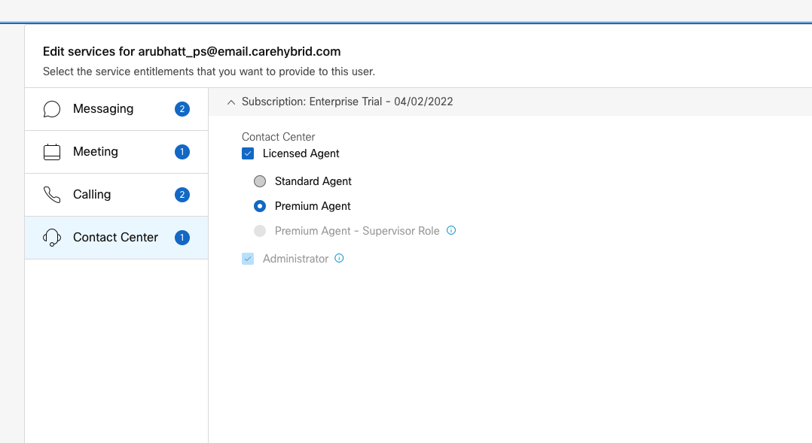

**Enable Instant Connect meeting and configure SMS**

- Go to [https://instant\.webex\.com/](images/https://instant.webex.com/) > Click Activate

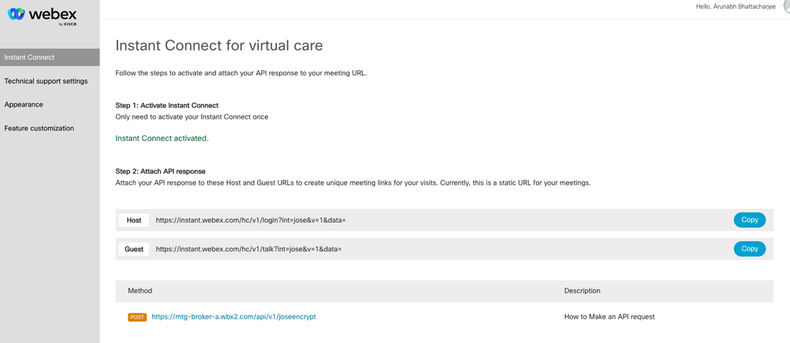

- Go to Feature Customization and Enable “Invite Guest by Text Message”

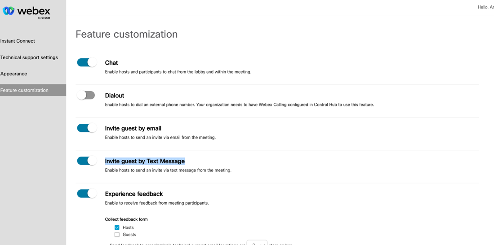

**Step 2: Create a new Bot Account on developer\.webex\.com to obtain an access token\.**

- This account will be used with the instant connect API behind the scenes to create a meeting, send an SMS meeting link, etc\.
- After creating the bot, copy the Access Token for future use in Step 5\.

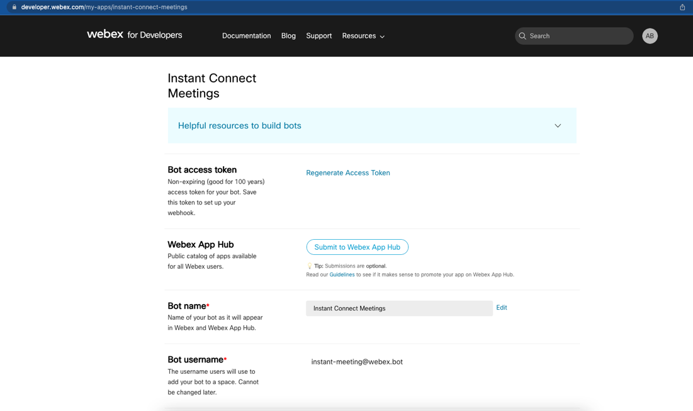

**Step 3: Create a new integration \(Webhook\) with Webex Connect which will be used for the desktop trigger**

- Webex Connect Homepage > Assets
- Select Integrations

\_\_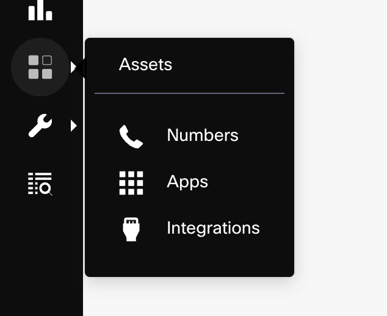\_\_

- Select Add Integration \- 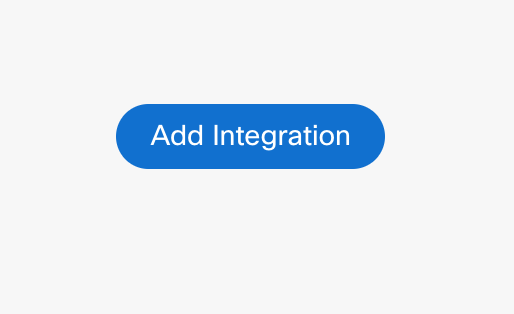

- select Inbound Webhook
- Name: Invite to Video
- Paste Sample Input:

\{

    "SMS": "12263762555",

    "SMSID": "XXX",

    "Channel": "SMS",

    "FacebookPSID": "XXXXX",

    "CustomerID": "XXXX",

    "ThreadID": "XXXXX",

    "LiveChatID": "XXXXXX",

    "AppID": "XXXXXX",

    "BrowserFingerprint": "XXXXX",

    "AgentID": "XXXX",

    "AgentEmailID": "XXXX",

    "AgentName": "XXXXX",

    "WhatsAppMobile": "xxx"

\} 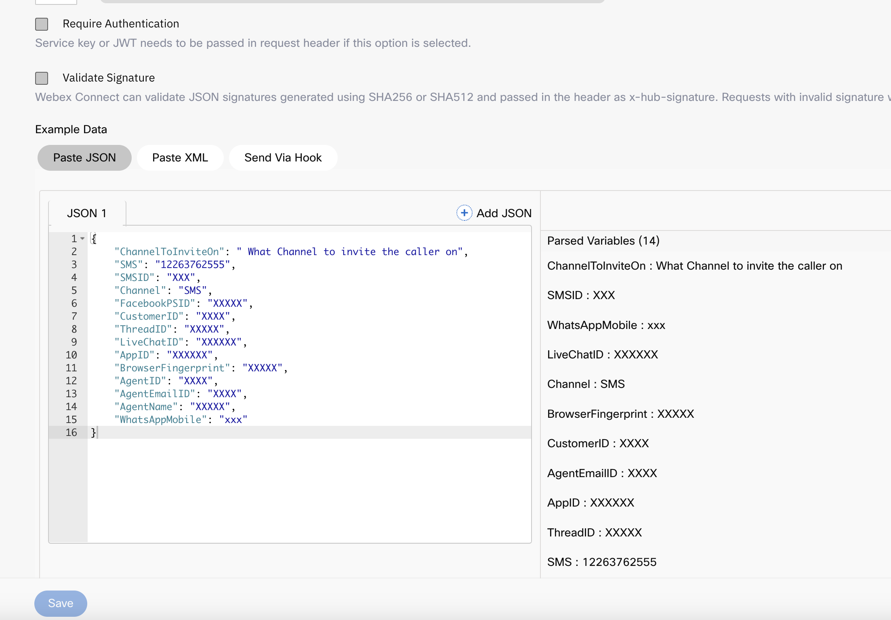

- Select Parse
- Save Webhook
- Copy URL to clipboard

**Step 4: Login into Webex Contact Center Admin Portal to create desktop triggers**

- Select Groups
- Select Default
- Select Default Team \(see below\)

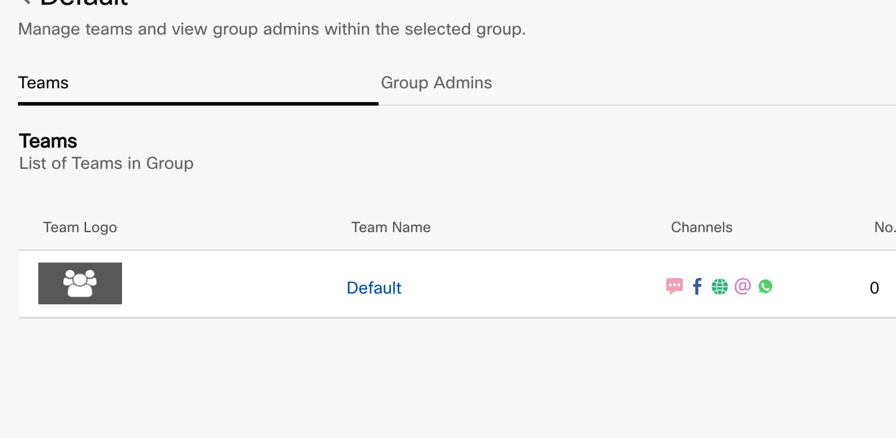

- Select Events and Rules
- Add New Event \(see below\)

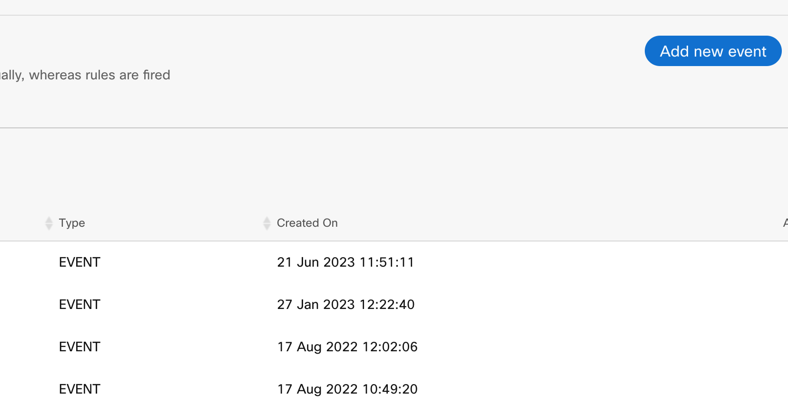

Name: Invite to Video

Method: Post

URL: Paste URL that was copied above when creating desktop trigger

Expected Response Format: JSON

Check \(Wait for Response\)

Check \(Display Response on Chat Console\)

Payload: Key Value Pair

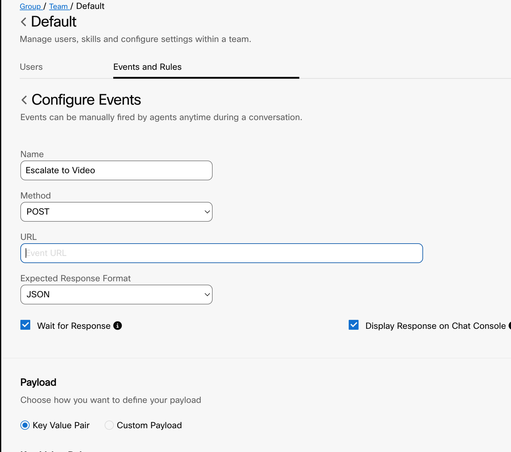

- Assign the follow Key Value Pairs \(Note: values must be exact\!\)

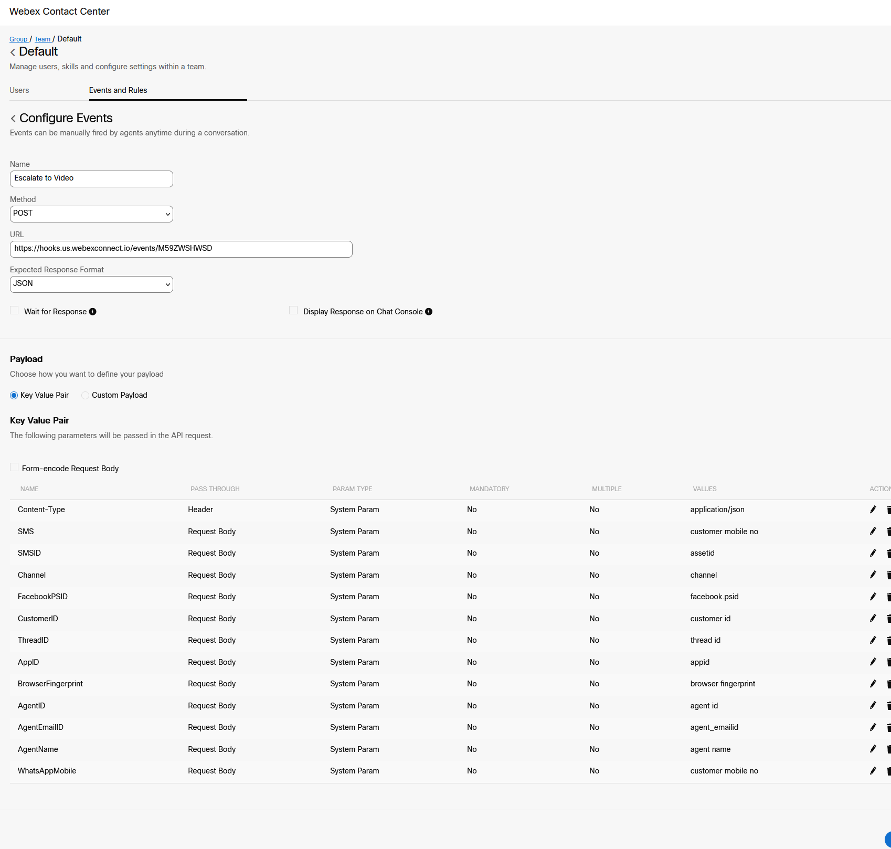

- Save Changes

**Step 5: Import template flow into Webex Connect \(IMI\)**

- We recommend creating a service strictly dedicated to desktop triggers as best practice
- Download digital flow: [WxCC Digital Escalation Flows](images/https://cisco-my.sharepoint.com/:f:/p/cguadamu/Eg8vH3MxzshPhCSV0MGYCLABljx2dB57oIqydaJwK4iaHg?e=wK5FVc)
- Inside of newly created service, go to Create Flow

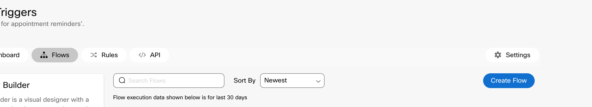

Flow Name: Digital_To_Video.workflow

Method: Upload a flow

> File: Select DigitalChannelVideoEscalation\.workflow that was just downloaded above

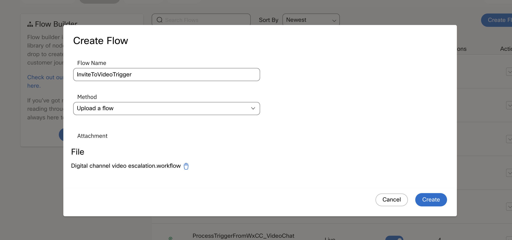

- Select**Create**
- Configuration – **Select existing webhook** button
- Webhook Name – Using the**drop down** menu select the Invite To Video webhook created in step 3
- Select**Save**
- Go to **Flow** >> **Settings** within the current flow
- On **Custom Variables Tab** under **Token**, paste bot token value obtained in Step 2
- Select Make Live

> **This singular flow can be utilized for chat, SMS, FBM and Whatsapp\. The flow won’t save unless FBM, chat, and WhatsApp digital assets are configured\. User can remove the nodes not in use within the flow without affecting the entire flow prior to making the flow live\.**

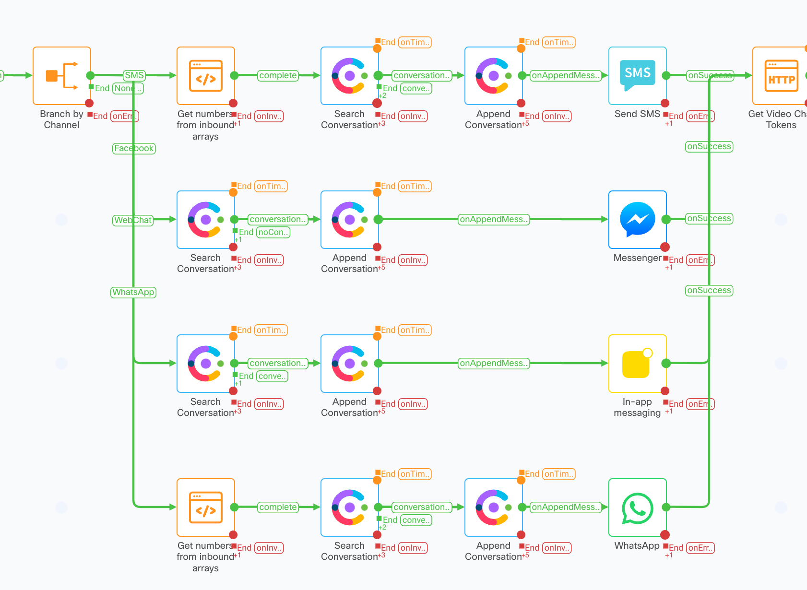

> **Agent can now see “Invite to Video” as a workflow option and will be provided a link to join as host\.**

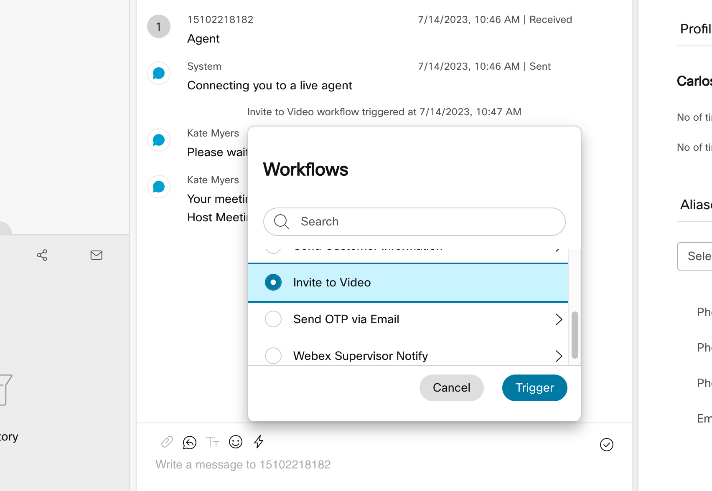

> **The Customer will need to join using the meeting link on their current device (Could be a Desktop PC or Phone or Tablet)**

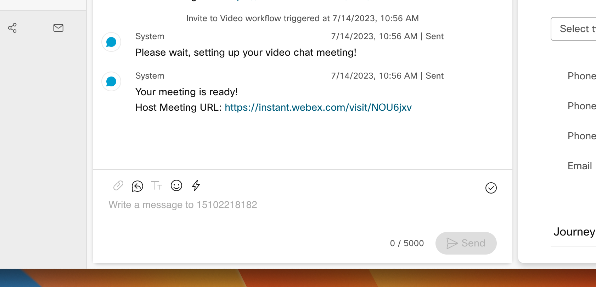
