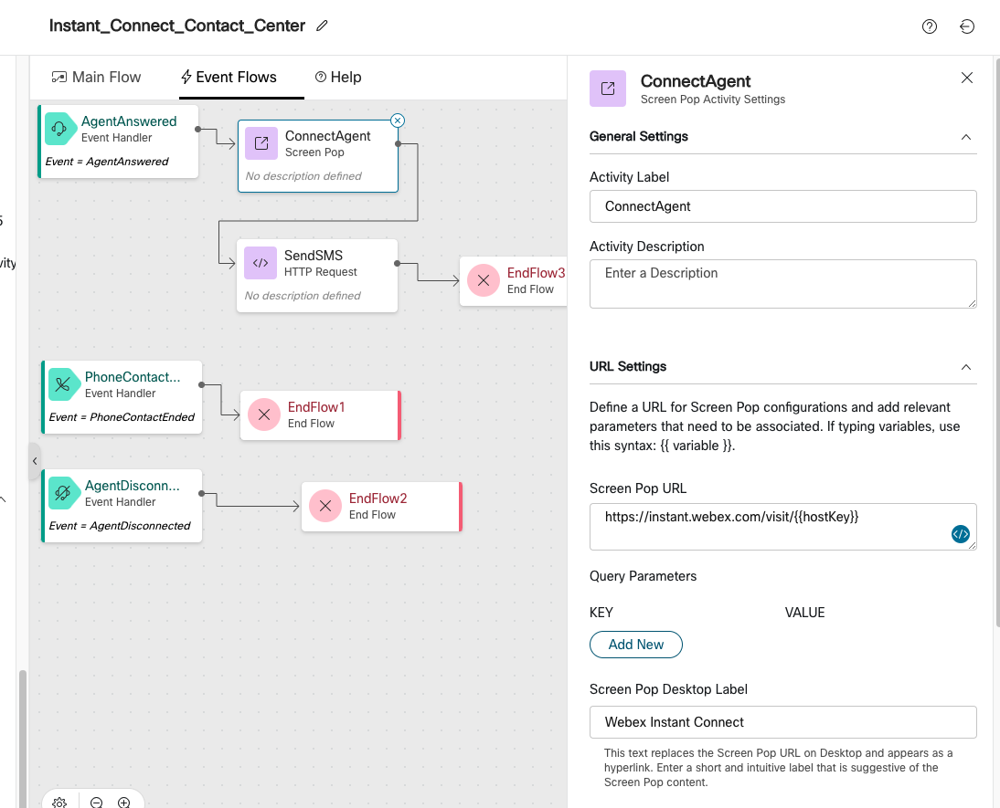
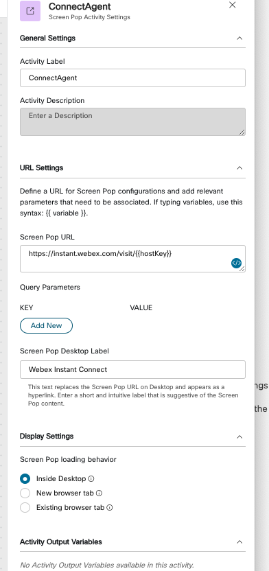
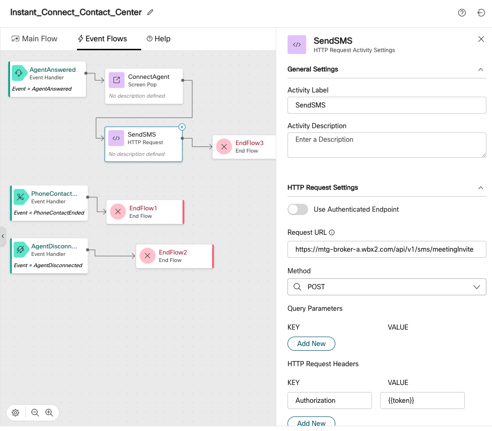
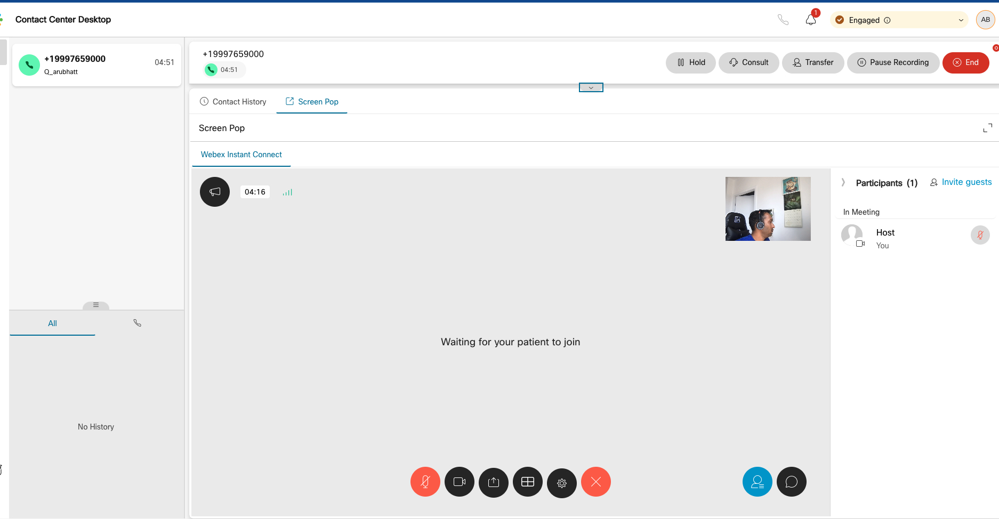
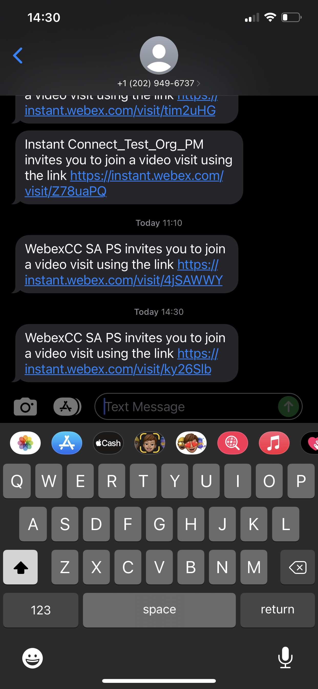
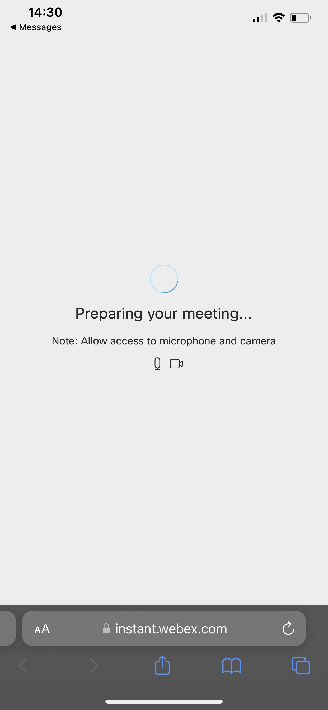

# Webex Instant Connect with Webex Contact Center

## Voice to Video Escalation to enable Video Contact Centers


**[Watch Now: Voice to Video Contact Center with Instant Connect](https://app.vidcast.io/share/168c7b94-6fd9-48d1-9457-69d6dc643cc3)**

**Overview**

Customers reach businesses via Webex Contact Center to be connected to Agents\. Webex Contact Center enables Self\-service and Queuing and picks the right agent using Routing Algorithms\.

We want the customers and Agents to be able to share a video feed, while communicating on a voice call\.

In other words, we want the voice call to be able to be escalated to video – based on the use cases that need a voice and video feed \(e\.g\., Product Support, Healthcare consulting, etc\.\)\.

**Use Case: Voice to Video escalation**

Customer calls into the Webex Contact Center via the telephony channel and gets connected to an Agent\. At the same time, the Contact Center offers also offers video support on demand via an SMS link to the customer so the customer can share a video feed of the issue at hand, for the agent to better handle the problem\. The Agent and Customer can video consult, while already connected on an Audio call\.

**Example Scenario**

Customer calls in regarding a device problem\. The Agent is connected on voice and customer receives an SMS to share a live video feed to the agent regarding the device diagnostic status, the agent is able to guide the customer more effectively having seen the problem live\.

**Configuration**

**Pre\-Requisites:**

- Webex Contact Center is already configured for the org\.
- Voice telephony is already using Webex Contact Center to route to an Agent\.
- Self Service menus and Routing are already setup on Webex Contact Center\.

The voice to video use case requires 3 items to be configured\. It is a simple 3 step process\.

**Step 1: Enable the organization for Webex Meetings and Configure Instant Connect**

1 meeting license is sufficient\. Assign this license to the administrator\.

[https://admin\.webex\.com/meeting/sites](https://admin.webex.com/meeting/sites)

Organization License snapshot


**Admin Meeting License – Admin who will create the Bot Token**


**Agent License – For Contact Center**


**Enable Instant Connect meeting and configure SMS**

- Go to [https://instant\.webex\.com/](https://instant.webex.com/) > Click Activate


- Go to Feature Customization and Enable “Invite Guest by Text Message”


**Step 2: Create a new Bot Account on developer\.webex\.com to obtain an access token\.**

- This account will be used with the instant connect API behind the scenes to create a meeting, send an SMS meeting link, etc\.
- After creating the bot, copy the Access Token for future use in Step 3\.


**Step 3: Import the Instant_Connect_Contact_Center\.json Flow into Webex Contact Center\.**

- After importing the flow, this is how it looks\.


- You can see that the flow has the following mandatory flow variables

**OrgId** - Org ID of the organization – required for sending an SMS

**Token** - Bot token you created – required for authorization

**GuestKey** – Guest URL shorthand

**HostKey** – Host URL Shorthand

**Overall Flow**

**Section 1 – This is where the meeting invite is created for 1 host and 1 guest\. 1 HTTP POST request node\.**


**Generate Link Node – HTTP POST Node**

This is used to create a meeting link that will be popped into the Agent Desktop as a live meeting

```
curl --location --request POST '[https://mtg\-broker\-a\.wbx2\.com/api/v2/joseencrypt](https://mtg-broker-a.wbx2.com/api/v2/joseencrypt)' \\

--header 'Authorization: Bearer \{\{token\}\}' \\

--header 'Content\-Type: application/json' \\

--data\-raw '\{

"jwt": \{

"sub": "\{\{NewPhoneContact\.interactionId\}\}"

\},

"aud": "a4d886b0\-979f\-4e2c\-a958\-3e8c14605e51",

"numHost": 1,

"numGuest": 1,

“verticalType”: cc,

"provideShortUrls" : true

\}'
```


**Section 2 – This is where the Agent Screen pop is sent to the agent\. 1 Screen pop GET URL node\. Agent is made the host of the meeting\.**

**GET** [**https://instant\.webex\.com/visit/\{\{hostKey**](https://instant.webex.com/visit/{{hostKey)**\}\}**

**hostKey is extracted from Section 1 – Generate meeting Link**



- Screenpop is configured to be inside the Desktop for an integrated Experience with the Agent Desktop\.
- This is modifiable to pop into a new browser tab if the meeting needs to be full screen\.



**Section 3 – This is where the Customer SMS is sent with the Guest Link URL\. Customer is the guest of the meeting \(No login required\)**

```curl
curl --location --request POST '[https://mtg\-broker\-a\.wbx2\.com/api/v1/sms/meetingInvite](https://mtg-broker-a.wbx2.com/api/v1/sms/meetingInvite)' \\

--header 'Authorization: Bearer \{\{token\}\}' \\

--header 'Content\-Type: application/json' \\

--data\-raw '\{

    "integration": "jose",

    "vertical": "cc",

    "orgId": "1c71287f\-2f41\-458b\-b101\-c4e616123554",

    "meetingId": "\{\{NewPhoneContact\.interactionId\}\}",

    "mobileNumbersWithCountryCode": \[

        "\{\{NewPhoneContact\.ANI\}\}"

    \]

\}'
```

**Send SMS Node Settings**




**Demo**

**Workflow and Narrative**

- Customer calls into the business\. Self\-service is minimal, an Agent is selected, and the call is connected\.
- In parallel, the Customer receives a link via SMS and the Agent automatically joins the Instant Connect Webex meeting that gets delivered on the Agent Desktop when the call is answered\.
- The customer is able to turn on the speaker phone and join the instant connect meeting\.
- Audio flows through the existing Webex Contact Center Agent to Customer voice path\.
- Video flows through the Instant Connect meeting to provide a live video feed\.
- There is minimal lag between the audio and video feed/channels\.

**Screenshots**

**Agent – Incoming Meeting with Screen pop**


**Agent \- Joined Meeting**



**Customer – SMS meeting link**



**Customer – Joined meeting**


---
