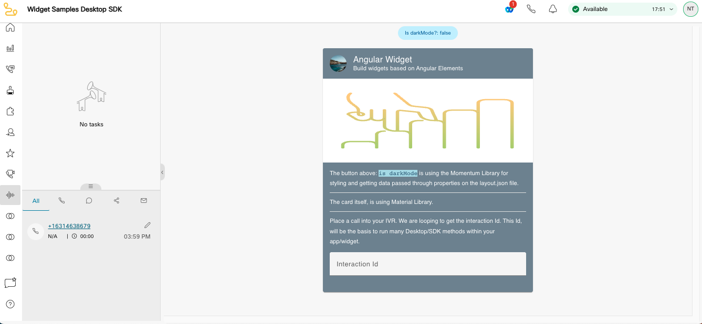

## Disclaimer

# SA Widget - Angular

This project was generated with [Angular CLI](https://github.com/angular/angular-cli) version 15.2.9



This widget starter can be run on `localhost` to be reviewed. In case you (the developer) are using this widget starter as a foundation of your custom widget, running the sandbox environment on `localhost` would be a perfect way to build your widget's logic and interface.

**Note**: please keep in mind that we recommend to design every widget as responsive. With the exception of widgets for Agent or Supervisor Desktop **header** zone (where widgets should not exceed 64px height), you can assume that your custom widget might end up getting placed on various canvas sizes. Based on the Agent's screen size and configuration by the Administrator, it could even end up with a different aspect ratio. Please keep that in mind while testing your responsive widget's behavior.

# Development

### Prerequisites

Before starting, make sure you have **yarn** and **angular cli** installed to be able to run the scripts in the `package.json`. Angular v15 supports these node.js versions and above: 14.20.x, 16.13.x and 18.10.x(this can be checked in your terminal with `node -v`).

## Getting Started

To run your widget on `localhost`, please navigate to widget's root directory in Terminal (Command line tool) and run the following commands (Assuming you have [`yarn`](https://classic.yarnpkg.com/en/docs/install/#mac-stable) installed globally on your machine):

1. Clone this repo.
2. Run `yarn` or `yarn install` from the root of the repo.
3. Run `ng serve` or `yarn start` for a development server. Navigate to `http://localhost:4200/`. The application will automatically reload if you change any of the source files.

## Code scaffolding

Run `ng generate component component-name` to generate a new component. You can also use `ng generate directive|pipe|service|class|guard|interface|enum|module`.

## Build

Run `ng build` to build the project. The build artifacts will be stored in the `dist/` directory.
To achieve a single bundle file in Angular we are using the package `ngx-build-plus`

## Running unit tests

Run `ng test` to execute the unit tests via [Karma](https://karma-runner.github.io).

## Running end-to-end tests

Run `ng e2e` to execute the end-to-end tests via a platform of your choice. To use this command, you need to first add a package that implements end-to-end testing capabilities.

## Further help

To get more help on the Angular CLI use `ng help` or go check out the [Angular CLI Overview and Command Reference](https://angular.io/cli) page.

# Ready to Integrate?

## Building/exporting widget

Once you are ready to export your widget, all you need is to run the following command in Terminal (Command line tool):

```
ng build
```

We are using a library called `ngx-build-plus` in order to build package in a single js file. You can also use webpack or CAT the multiple js files that Angular produces for production.

If you get any errors or dont see a single main.js file in the dist folder try adding the library with Run: `ng add ngx-build-plus`

Running `ng build` will create a /dist/ folder in the root directory of our widget and immediately run `package` after to create a single `main.js` file that contains the entire widget to be integrated. This file can be renamed and uploaded to a preferred location on a CDN (e.g. an S3 bucket on AWS. Please keep in mind that this file has to be publicly available over the internet to be accessible to Agent or Supervisor Desktop).

## Sharing with Agent/Supervisor Desktop Administrator

To be able to place your custom widget within Agent/Supervisor Desktop, Contact Center Administrator will need three pieces of information:

1. The URL to the `***.js` file that you had previously generated and placed on a CDN.
2. Information regarding any properties/attributes that are required to be set for the widget to function (e.g. for Maps widget in th Examples folder, one will require to pass Google Maps API key to an `api-key` attribute).

   If you require dynamic data from Agent/Supervisor Desktop, you might want to either request it though [`wxcc-js-api`](https://www.cisco.com/c/en/us/td/docs/voice_ip_comm/cust_contact/contact_center/webexcc/developer_20/webexcc_b_20-desktop-developer-guide-/webexcc_m_30-javascript-sdk.html) methods within your widget, or through properties - when the list of [Data Providers](https://www.cisco.com/c/en/us/td/docs/voice_ip_comm/cust_contact/contact_center/webexcc/developer_20/webexcc_b_20-desktop-developer-guide-/webexcc_m_30-build-a-custom-widget.html#Cisco_Reference.dita_f673d97b-a10a-48b7-9ebe-05c188980918) contains the required information.

3. A quick preview/screenshot or the aspect ratio that is optimal for this widget. This way, an administrator will be able to make the best decision while placing it on the Desktop layout. ### Placing Widget in JSON layout
   **Reference**: [Desktop Layout Reference guide for Administrator](https://www.cisco.com/c/en/us/td/docs/voice_ip_comm/cust_contact/contact_center/webexcc/SetupandAdministrationGuide_2/b_mp-release-2/b_cc-release-2_chapter_011.html#topic_8230815F4023699032326F948C3F1495).

In case you are an administrator for Contact Center Agent Desktop or are working with an administrator, you might be trying to place this component in a JSON layout specification file to test in your Contact Center environment.

This specific Widget Starter is designed to be placed in a ["panel"](https://www.cisco.com/c/en/us/td/docs/voice_ip_comm/cust_contact/contact_center/webexcc/SetupandAdministrationGuide_2/b_mp-release-2/b_cc-release-2_chapter_011.html#Cisco_Generic_Topic.dita_1ae68ee3-0948-47ad-a04d-ae182dae573e) area of JSON layout specification. This is due to this widget relying on a task-specific information with the reference derived from the current location/address bar value.

**NOTE**: If you place this widget in another area in JSON layout specification ("header" or a custom page in "navigation"), some task-specific function might not work. This is to be expected.

Please feel free to reach out to your partner or Cisco directly with any additional questions.
