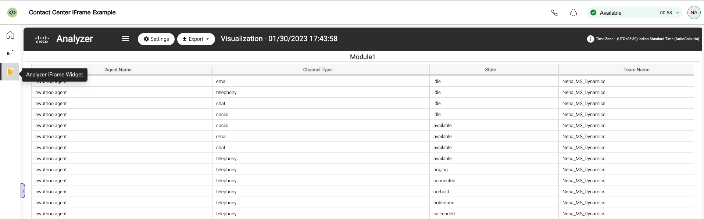

## WebexCC iFrame Widget Sample - Analyzer Reporting Widget

**Pre-requisites:**

- Before you begin, you must create an Analyzer Report on WebexCC Analyzer.
- The URL is in the format: https://analyzer.wxcc-_____.cisco.com where \_\_ is the datacenter (us1,eu1,eu2,etc.)
- Once the report is created, click on run. It will be in the format:
  `https://analyzer-v2.wxcc-us1.cisco.com/analyzer/view/visualization?tId=_____&rId=__` where tId is the org ID and rId is the report ID.

- Copy the URL of your custom report, and into the Desktop Layout. In the attached JSON, the desktop layout has an iFrame Navigation tab widget seen in lines 102-128.

- Change the source ("src") tag for the iFrame element inside the Desktop Layout JSON and point it to the Analyzer Report.

- Attached is the desktop layout file: `Analyzer_iFrame_Widget.json`

- Upload the Desktop layout on portal and login to the right team to display.

## Support

For dedicated Developer Support on the APIs - Please open a ticket with the team using this link: **[Webex Contact Center Developer Support](https://developer.webex-cx.com/support)**

For discussions on the samples, feel free to participate in our Developer Community:

**[Webex Contact Center APIs Developer Community](https://community.cisco.com/t5/contact-center/bd-p/j-disc-dev-contact-center)**

Refer: **[How to Ask a Question or Initiate a Discussion](https://community.cisco.com/t5/contact-center/webex-contact-center-apis-developer-community-and-support/m-p/4558270)**

## Change Log

The following change log shows the version updates to the files and what enhacements were added:

| #   | Date      | File name                           | Version | Comment                                                       |
| --- | --------- | ----------------------------------- | ------- | ------------------------------------------------------------- |
| 1   | June 2022 | Analayzer_iFrame_Widget_Layout.json | 0.0.1   | Initial Layout with iFrame widget pointing to Analyzer Report |
