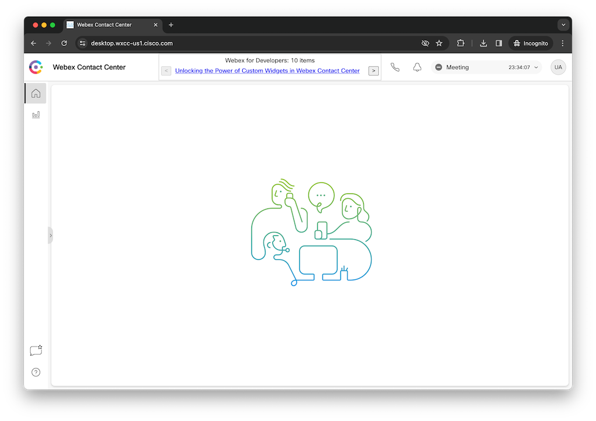

# RSS Header Widget Sample

This is a sample project to demonstrate a custom RSS header widget built using LitElement for use as a Webex Contact Center Header Desktop Widget.



## Video Walkthrough

Please watch this Vidcast for a tour of this sample application:
https://app.vidcast.io/share/25fd0dbc-e3f4-49af-86a3-3c28ee788153

## Installation

To install the project, run the following command in your terminal:

```shell
npm install
```

This will install all the dependencies listed in `package.json`.

## Usage

The main file is `src/rss-widget.js` which exports a custom LitElement component. This custom element is meant to be used as a header widget in Webex Contact Center.

## Integrating with Webex Contact Center

This project can be integrated with Webex Contact Center to display the RSS feed widget on the agent's desktop.

To achieve this, you need to use the [`layout.json`](./layout.json) file to define the desktop layout and run the project on a local server. 

### Layout Configuration:

The [`layout.json`](./layout.json) file defines the layout of the agent's desktop in Webex Contact Center. This file includes a reference to the RSS feed widget, specifying its position and size in the header.

Here's the section of the `layout.json` file that includes the RSS feed widget:

```json
"advancedHeader": [
    {
    "comp": "rss-widget",
    "script": "http://localhost:8000/rss-widget.js"
    },
    {
    "comp": "agentx-webex"
    },
    {
    "comp": "agentx-outdial"
    },
    {
    "comp": "agentx-notification"
    },
    {
    "comp": "agentx-state-selector"
    }
],
```

This configuration will display the RSS feed widget in a panel on the agent's desktop. The `url` property points to the location of the built JavaScript file for the widget.

### Running the project on a local server:

You can serve the built files and make them available via localhost by running:

```shell
npm run serve:cdn
```

This command will start Rollup in watch mode and @web/dev-server to serve your `build` directory. 

When you start this command, the web component will be available at `http://localhost:8000/rss-feed.js` (or whatever port your server is running on). This URL can be used in the `layout.json` file to point to the RSS feed widget.

Please note that Webex Contact Center may not be able to access localhost URLs. In a production environment, you should host your built files on a publicly accessible server or CDN.

## Development

This project uses Lit, Rollup, and @web/dev-server for development. 

### Serving the project:

To start the development server, run:

```shell
npm run serve
```

This will start @web/dev-server and watch your files for changes.

### Building the project:

To build the project, run:

```shell
npm run build
```

This command will generate a production-ready, IIFE standalone JavaScript file in the build directory using Rollup that can be used with Webex Contact Center.

### Serving the built files:

To serve the built files and enable live reloading, run:

```shell
npm run serve:cdn
```

This command will start Rollup in watch mode and @web/dev-server to serve your `build` directory.

## License

This project is licensed under the ISC License.