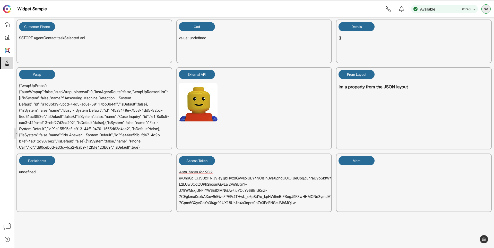
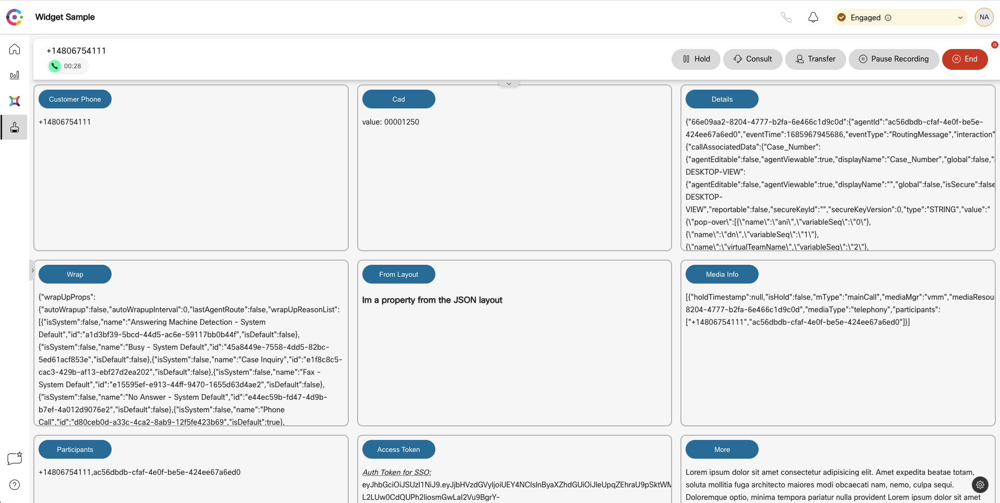

## Desktop Widget 101 - Sample Widget & working with the STORE

This is a tutorial on how to use the Agent Desktop Layout along with a Vanilla JS Web Component desktop widget, and shows the ability to pass data into the widget.
This will help developers understand how data is handled in the Desktop STORE and injected into widgets inside of Webex Contact Center desktop.
Watch the demo below to understand what this widget does and how to set it up and extend on it.

## Watch [Part 1 of 2: Sample web component Widget](https://app.vidcast.io/share/7ca5247d-462b-4b49-859c-62bee86477a3)

## Watch [Part 2 of 2: Sample web component Widget](https://app.vidcast.io/share/6e211cd5-e0c6-4c38-a1dc-df647b60a0b3)

## Developer Documentation

**https://developer.webex-cx.com/documentation/guides/desktop**

## Getting Started

The widget can be hosted locally and the demo covers how this is done by building and hosting the widget on localhost.

To understand how to interact with our Desktop Layout, please watch the video and supplemental detailed documentation @ **[Desktop Layout - Administration Guide](https://www.cisco.com/c/en/us/td/docs/voice_ip_comm/cust_contact/contact_center/webexcc/SetupandAdministrationGuide_2/b_mp-release-2/b_cc-release-2_chapter_011.html#topic_8230815F4023699032326F948C3F1495)**

To understand more about the Desktop STORE, please also look at the **useful links** below for additional references.

### Executing the sample

How to run the sample widget:

- **Step 1:**

_To use this widget sample on your localhost_

- Inside this project on your terminal type: `npm install`
- Then inside this project on your terminal type: `npm run dev`
- This should run the app on your localhost:5000

- **Step 2:**

_To wire up the Widget to the Layout:_

- Upload the **_widgetStoreSample.json_** file onto your Administration Portal **[WebexCC Portal - US](https://portal.wxcc-us1.cisco.com/portal/home.html#)**
  - _link above is referencing the US portal link please change if you are in different geo (us1, eu1, eu2, anz1)_
  - Note that Layouts are configured per Agent Team.
- Log in to your agent and select the right Team to view the new layout.

- **Step 3:**
  - The CAD variables used in this demo are specific to a tenant. You will have to modify the **_widget-store-sample.js_** file to reflect your custom variables.
  - After that on your terminal run: `npm run build`. This will rebuild the project and create the updated **bundle.js**
  - Followed by `npm run dev`. This will run the app on your localhost.
  - To learn more about CAD variables please refer to the links below.

**Additional Improvements:**

- You can modify the widget as required.
- To create a new compiled JS file, using `npm run build` which will create the new compiled JS under `build/bundle.js`.
- You may rename this file, host it on your server of choice, and use this as the widget `src` parameter in the layout.

## Useful Links - Supplemental Resources

[Desktop JS SDK Official Guide](https://developer.webex-cx.com/documentation/guides/desktop)

[Administration Guide for Desktop Layouts](https://www.cisco.com/c/en/us/td/docs/voice_ip_comm/cust_contact/contact_center/webexcc/SetupandAdministrationGuide_2/b_mp-release-2/b_cc-release-2_chapter_011.html#topic_8230815F4023699032326F948C3F1495)

[Desktop Widgets Starter Pack & Widgets - GitHub Repo](https://github.com/CiscoDevNet/webex-contact-center-widget-starter)

[Desktop Widgets Live Demo](https://ciscodevnet.github.io/webex-contact-center-widget-starter/)

## Disclaimer

> These samples are meant to be used, as "samples", for demos, and to understand how to interact w
> ith the WebexCC APIs.
> When building a production grade solution, please consider the overall architecture and design with a security first approach.
> Also, please consider how you would extend this app for multiple orgs, manage tokens for the orgs, etc.
> These samples are only meant to provide working, starter code and many layers have been simplified and abstracted away to focus on the Webex Contact Center use cases.

## Support

For dedicated Developer Support on the APIs - Please open a ticket with the team using this link: **[Webex Contact Center Developer Support](https://developer.webex-cx.com/support)**

For discussions on the samples, feel free to participate in our Developer Community:

**[Webex Contact Center APIs Developer Community](https://community.cisco.com/t5/contact-center/bd-p/j-disc-dev-contact-center)**

Refer: **[How to Ask a Question or Initiate a Discussion](https://community.cisco.com/t5/contact-center/webex-contact-center-apis-developer-community-and-support/m-p/4558270)**

## Version History

- 1.0.0
  - a few GET methods & updated readme
    <!-- * See [commit change]() or See [release history]() -->
    <!-- * See [commit change]() or See [release history]() -->
